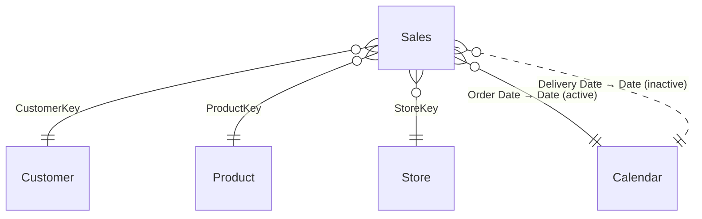

# Sales – Power BI Semantic Model Documentation

> *Auto-generated documentation.*

## Table of Contents
1. [Overview](#overview)
2. [Table Relationships](#table-relationships)
3. [Tables and Columns](#tables-and-columns)
4. [Measures](#measures)
5. [Row-Level Security](#row-level-security)
6. [Data Sources](#data-sources)

---

## Overview

The **Sales** semantic model is a retail sales analytics dataset covering customers, products, stores, and transactional sales data. It provides a rich set of measures for analysing sales performance, profitability, and trends over time.

| Property | Value |
|---|---|
| Tables | 6 |
| Relationships | 5 |
| Measures | 13 |
| RLS Roles | 2 |
| Storage Mode | Import |

---

## Table Relationships

The model uses a classic star-schema design with **Sales** as the central fact table connected to four dimension tables. The relationship between `Sales[Delivery Date]` and `Calendar[Date]` is **inactive** and must be activated explicitly in DAX via `USERELATIONSHIP()`.



| From Table | From Column | To Table | To Column | Cardinality | Active | Cross-filter |
|---|---|---|---|---|---|---|
| Sales | CustomerKey | Customer | CustomerKey | Many-to-One | ✅ Yes | One Direction |
| Sales | ProductKey | Product | ProductKey | Many-to-One | ✅ Yes | One Direction |
| Sales | StoreKey | Store | StoreKey | Many-to-One | ✅ Yes | One Direction |
| Sales | Order Date | Calendar | Date | Many-to-One | ✅ Yes | One Direction |
| Sales | Delivery Date | Calendar | Date | Many-to-One | ❌ No | One Direction |

---

## Tables and Columns

### Sales (Fact Table)
Stores individual sales transaction lines including order details, keys to dimensions, quantities, prices, and costs.

| Column | Data Type | Hidden | Notes |
|---|---|---|---|
| Order Number | Integer | No | Transaction order identifier |
| Line Number | Integer | No | Line item number within an order |
| Order Date | Date | No | Date the order was placed; used in active relationship with Calendar |
| Delivery Date | Date | No | Date the order was delivered; used in inactive relationship with Calendar |
| CustomerKey | Integer | ✅ Yes | Foreign key to Customer table |
| StoreKey | Integer | ✅ Yes | Foreign key to Store table |
| ProductKey | Integer | ✅ Yes | Foreign key to Product table |
| Unit Cost | Decimal | ✅ Yes | Unit cost of the product |
| Currency Code | Text | No | ISO currency code of the transaction |
| Exchange Rate | Decimal | No | Currency exchange rate at the time of sale |
| Environment | Text | No | Environment tag (DEV / QUAL / PRD) |
| Time | Time | No | Randomly generated transaction time |
| Quantity | Integer | ✅ Yes | Number of units sold |
| Net Price | Decimal | ✅ Yes | Net selling price per unit |

---

### Calendar (Date Dimension)
A generated date table covering a rolling 3-year window from the current year. Marked as the date table for time-intelligence calculations.

| Column | Data Type | Hidden | Notes |
|---|---|---|---|
| Date | Date | ✅ Yes | Primary key; used in relationships with Sales |
| Day | Integer | No | Day of the month (1–31) |
| Month | Integer | ✅ Yes | Month number (1–12); used as sort column for Month Name |
| Month Name | Text | ✅ Yes | Abbreviated month name (e.g., Jan, Feb) |
| Quarter | Text | No | Calendar quarter (e.g., Q1) |
| Year | Integer | No | Calendar year |
| Year-Month | Date | No | First day of the month; formatted as "MMM YYYY" |
| Week Number | Integer | No | ISO week number of the year |
| Day of Week | Integer | No | Day index (1 = Sunday); used as sort column for Day Name |
| Day Name | Text | No | Full day name (e.g., Monday) |
| Is Weekend | Boolean | ✅ Yes | `true` if Saturday or Sunday |
| Fiscal Year | Integer | ✅ Yes | Fiscal year (July–June cycle; increments on July 1) |
| Fiscal Quarter | Text | No | Fiscal quarter label (e.g., FQ1) |

**Hierarchy:** `Year-Month-Day` → Year → Month → Day

---

### Product (Dimension)
Product catalogue with categorisation, pricing, and physical attributes.

| Column | Data Type | Hidden | Notes |
|---|---|---|---|
| ProductKey | Integer | ✅ Yes | Primary key |
| Product | Text | No | Product display name (default label) |
| Product Code | Text | No | Internal product code |
| Manufacturer | Text | No | Manufacturer name |
| Brand | Text | No | Brand name |
| Color | Text | No | Product colour |
| Weight Unit Measure | Text | No | Unit of measure for weight (e.g., kg, lb) |
| Weight | Decimal | No | Product weight |
| Unit Cost | Decimal | No | Standard unit cost |
| Unit Price | Decimal | No | Standard list price |
| Subcategory Code | Text | No | Subcategory identifier code |
| Subcategory | Text | No | Product subcategory |
| Category Code | Text | No | Category identifier code |
| Category | Text | No | Product category |

---

### Customer (Dimension)
Customer master data with geographic and demographic attributes.

| Column | Data Type | Hidden | Notes |
|---|---|---|---|
| CustomerKey | Integer | ✅ Yes | Primary key |
| Customer | Text | No | Full customer name (default label) |
| Gender | Text | No | Customer gender |
| Address | Text | No | Street address |
| City | Text | No | City (geo-tagged) |
| State Code | Text | No | State/province abbreviation (geo-tagged) |
| State | Text | No | Full state/province name (geo-tagged) |
| Zip Code | Text | No | Postal/ZIP code (geo-tagged) |
| Country Code | Text | No | ISO country code (geo-tagged) |
| Country | Text | No | Country name (geo-tagged) |
| Continent | Text | No | Continent name (geo-tagged) |
| Birthday | Date | No | Customer date of birth |
| Age | Integer (Calculated) | No | Calculated column: current age in years (`DATEDIFF([Birthday], TODAY(), YEAR)`) |

---

### Store (Dimension)
Retail store information including location, size, and operational status.

| Column | Data Type | Hidden | Notes |
|---|---|---|---|
| StoreKey | Integer | ✅ Yes | Primary key |
| Store Code | Text | No | Internal store code |
| Store | Text | No | Store display name (default label) |
| Country | Text | No | Country where the store is located (used in RLS) |
| State | Text | No | State/province of the store |
| Square Meters | Integer | No | Store floor area in square metres |
| Open Date | Date | No | Date the store opened |
| Close Date | Date | No | Date the store closed (if applicable) |
| Status | Text | No | Operational status (e.g., Open, Closed) |

---

### About (Metadata)
A static lookup table with model metadata, used for informational display on report pages.

| Column | Data Type | Hidden | Notes |
|---|---|---|---|
| Key | Text | ✅ Yes | Metadata key (e.g., "Version", "Developed by") |
| Value | Text | No | Metadata value |
| Order | Integer | ✅ Yes | Sort order for display |

---

## Measures

All measures are organised by the table they reside in.

### Sales Table

#### # Sales
**Business logic:** Counts the total number of individual sales transaction lines in the current filter context.

```dax
# Sales = COUNTROWS('Sales')
```

---

#### Sales Qty
**Business logic:** Sums the total quantity of units sold across all transactions in the current filter context.

```dax
Sales Qty = SUM('Sales'[Quantity])
```

---

#### Sales Amount
**Business logic:** Calculates total revenue by multiplying the quantity by the net selling price for each transaction row and summing the results. Uses `SUMX` to ensure correct row-by-row calculation.

```dax
Sales Amount = SUMX('Sales', 'Sales'[Quantity] * 'Sales'[Net Price])
```

---

#### Sales Amount (LY)
**Business logic:** Returns the Sales Amount for the same period in the prior year. Returns blank if there were no current-year sales (avoids misleading comparisons for future periods).

```dax
Sales Amount (LY) =
IF ([Sales Amount] > 0, CALCULATE([Sales Amount], SAMEPERIODLASTYEAR('Calendar'[Date])))
```

---

#### Sales Amount Avg per Day
**Business logic:** Calculates the average daily sales amount by averaging the Sales Amount across each individual date in the current context. Useful for normalising comparisons across periods of different lengths.

```dax
Sales Amount Avg per Day = AVERAGEX(VALUES('Calendar'[Date]), [Sales Amount])
```

---

#### Sales Amount (6M average)
**Business logic:** Calculates the rolling 6-month average daily sales amount, anchored to the latest date in the current filter context. Returns blank if the 6-month window starts before any actual sales data exists.

```dax
Sales Amount (6M average) =
VAR v_selDate =
    MAX ( 'Calendar'[Date] )
VAR v_period =
    DATESINPERIOD ( 'Calendar'[Date], v_selDate, -6, MONTH )
VAR v_result =
    CALCULATE ( AVERAGEX ( VALUES ( 'Calendar'[Date] ), [Sales Amount] ), v_period )
VAR v_firstDate =
    MINX ( v_period, 'Calendar'[Date] )
VAR v_lastDateSales =
    MAX ( Sales[Order Date] )
RETURN
    IF ( v_firstDate <= v_lastDateSales, v_result )
```

---

#### Sales Amount (12M average)
**Business logic:** Calculates the rolling 12-month average daily sales amount, anchored to the latest date in the current filter context. Returns blank if the 12-month window starts before any actual sales data exists.

```dax
Sales Amount (12M average) =
VAR v_selDate =
    MAX ( 'Calendar'[Date] )
VAR v_period =
    DATESINPERIOD ( 'Calendar'[Date], v_selDate, -12, MONTH )
VAR v_result =
    CALCULATE ( AVERAGEX ( VALUES ( 'Calendar'[Date] ), [Sales Amount] ), v_period )
VAR v_firstDate =
    MINX ( v_period, 'Calendar'[Date] )
VAR v_lastDateSales =
    MAX ( Sales[Order Date] )
RETURN
    IF ( v_firstDate <= v_lastDateSales, v_result )
```

---

#### Cost
**Business logic:** Calculates total cost of goods sold by multiplying quantity by unit cost for each row and summing the results.

```dax
Cost = SUMX ( Sales, Sales[Quantity] * Sales[Unit Cost] )
```

---

#### Margin
**Business logic:** Calculates gross profit (margin) by computing the difference between the net selling price and the unit cost per transaction, multiplied by quantity, then summed across all rows.

```dax
Margin =
SUMX (
    Sales,
    Sales[Quantity]
        * ( Sales[Net Price] - Sales[Unit Cost] )
)
```

---

#### # Customers (w/ Sales)
**Business logic:** Counts the number of **distinct customers who have actually made a purchase** in the current filter context, by counting unique values in the CustomerKey column of the Sales table.

```dax
# Customers (w/ Sales) = DISTINCTCOUNT('Sales'[CustomerKey])
```

---

### Customer Table

#### # Customers
**Business logic:** Counts the total number of customers in the Customer dimension table in the current filter context, regardless of whether they have made any purchases.

```dax
# Customers = COUNTROWS('Customer')
```

---

### Product Table

#### # Products
**Business logic:** Counts the total number of products in the Product dimension table in the current filter context.

```dax
# Products = COUNTROWS('Product')
```

---

### Store Table

#### # Stores
**Business logic:** Counts the total number of stores in the Store dimension table in the current filter context.

```dax
# Stores = COUNTROWS('Store')
```

---

## Row-Level Security

Two RLS roles are defined on the **Store** table, restricting data visibility by country. Each role filters the Store table and — through the existing `Sales → Store` relationship — also restricts the sales transactions visible to the user.

| Role Name | Table | Filter Expression | Description |
|---|---|---|---|
| Store - Canada | Store | `[Country] == "Canada"` | Limits access to Canadian stores and their associated sales |
| Store - United States | Store | `[Country] == "United States"` | Limits access to US stores and their associated sales |

> **Note:** Both roles have `Read` model permission. Users assigned to a role will only see data for stores in their permitted country across all visuals connected to the Store dimension.

---

## Data Sources

All data is loaded in **Import** mode. Dimension tables are fully reloaded on each refresh; the **Sales** table supports incremental refresh via date-range parameters.

### Power Query Parameters

| Parameter | Type | Default Value | Allowed Values | Description |
|---|---|---|---|---|
| `HttpSource` | Text | `https://raw.githubusercontent.com/pbi-tools/sales-sample/data/` | — | Base URL for all CSV source files |
| `Environment` | Text | `DEV` | `DEV`, `QUAL`, `PRD` | Deployment environment tag; added as a column to the Sales table |
| `RangeStart` | DateTime | `2020-01-01 00:00:00` | — | Start of the incremental refresh window (applied to Sales[Order Date]) |
| `RangeEnd` | DateTime | `2024-12-31 00:00:00` | — | End of the incremental refresh window (applied to Sales[Order Date]) |
| `Randomizer` | Number | `0.6` | — | Controls the degree of random variation applied to quantities and prices in the Sales table for demo purposes |

### Table Data Sources

| Table | Source File | Notes |
|---|---|---|
| Sales | `{HttpSource}/RAW-Sales.csv` | CSV (13 columns). Dates are shifted forward to align with the current 3-year window. Quantities and net prices are randomised using the `Randomizer` parameter. Filtered by `RangeStart`/`RangeEnd` on Order Date for incremental refresh. |
| Product | `{HttpSource}/RAW-Product.csv` | CSV (14 columns). Full reload on each refresh. |
| Customer | `{HttpSource}/RAW-Customer.csv` | CSV (13 columns). Full reload on each refresh. The `Age` column from the source is removed and replaced by a calculated column using `DATEDIFF`. |
| Store | `{HttpSource}/RAW-Store.csv` | CSV (9 columns). Full reload on each refresh. |
| Calendar | *(Generated in Power Query)* | Dynamically generated date table spanning 3 years prior to the current date through the end of the current calendar year. No external source dependency. |
| About | *(Inline table)* | Static key-value metadata table defined directly in M. Includes model version, developer, description, and last refresh timestamp. |
