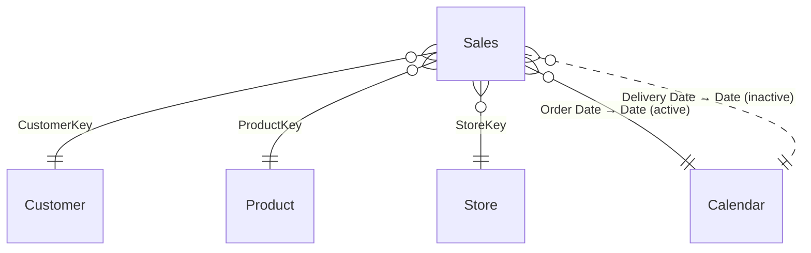

# Sales – Power BI Semantic Model Documentation

> *Auto-generated documentation.*

## Table of Contents
1. [Overview](#overview)
2. [Table Relationships](#table-relationships)
3. [Tables and Columns](#tables-and-columns)
4. [Measures](#measures)
5. [Row-Level Security](#row-level-security)
6. [Data Sources](#data-sources)

---

## Overview

The **Sales** semantic model provides a comprehensive view of retail sales performance, covering transactions, customers, products, stores, and a time calendar. It supports analysis across revenue, margin, cost, and customer activity dimensions.

| Property | Value |
|---|---|
| Tables | 6 |
| Relationships | 5 |
| Measures | 13 |
| Security Roles | 2 |
| Storage Mode | Import |

---

## Table Relationships

The diagram below shows all relationships between tables. Solid lines represent active relationships; the dashed line represents an inactive relationship.



| From Table | From Column | To Table | To Column | Cardinality | Active | Cross-Filter |
|---|---|---|---|---|---|---|
| Sales | CustomerKey | Customer | CustomerKey | Many-to-One | ✅ Yes | One Direction |
| Sales | ProductKey | Product | ProductKey | Many-to-One | ✅ Yes | One Direction |
| Sales | StoreKey | Store | StoreKey | Many-to-One | ✅ Yes | One Direction |
| Sales | Order Date | Calendar | Date | Many-to-One | ✅ Yes | One Direction |
| Sales | Delivery Date | Calendar | Date | Many-to-One | ❌ No | One Direction |

---

## Tables and Columns

### Sales
Fact table containing individual sales transaction lines. Each row represents a single line item on an order.

| Column | Data Type | Hidden | Notes |
|---|---|---|---|
| Order Number | Integer | No | Unique order identifier |
| Line Number | Integer | No | Line item number within the order |
| Order Date | Date | No | Date the order was placed |
| Delivery Date | Date | No | Date the order was delivered |
| CustomerKey | Integer | Yes | Foreign key to the Customer table |
| StoreKey | Integer | Yes | Foreign key to the Store table |
| ProductKey | Integer | Yes | Foreign key to the Product table |
| Unit Cost | Decimal | Yes | Cost per unit |
| Currency Code | Text | No | Currency used for the transaction |
| Exchange Rate | Decimal | No | Exchange rate applied to the transaction |
| Environment | Text | No | Deployment environment tag (DEV / QUAL / PRD) |
| Time | Time | No | Randomised time component of the order |
| Quantity | Integer | Yes | Number of units sold |
| Net Price | Decimal | Yes | Net selling price per unit |

---

### Calendar
Date dimension table covering a rolling 3-year window (dynamically generated). Includes calendar and fiscal date attributes.

| Column | Data Type | Hidden | Notes |
|---|---|---|---|
| Date | Date | Yes | Primary date key (used in relationships) |
| Year | Integer | No | Calendar year |
| Month | Integer | Yes | Month number (1–12) |
| Month Name | Text | Yes | Abbreviated month name (e.g. Jan) |
| Year-Month | Date | No | First day of the month (formatted as "MMM yyyy") |
| Quarter | Text | No | Calendar quarter (e.g. Q1) |
| Day | Integer | No | Day of the month |
| Week Number | Integer | No | ISO week number |
| Day of Week | Integer | No | Day of week number (1 = Sunday) |
| Day Name | Text | No | Full day name (e.g. Monday) |
| Is Weekend | Boolean | Yes | True if Saturday or Sunday |
| Fiscal Year | Integer | Yes | Fiscal year (July–June) |
| Fiscal Quarter | Text | No | Fiscal quarter (e.g. FQ1) |

**Hierarchy – Year-Month-Day**: Year → Month → Day

---

### Product
Dimension table containing product catalogue information.

| Column | Data Type | Hidden | Notes |
|---|---|---|---|
| ProductKey | Integer | Yes | Primary key |
| Product | Text | No | Product name (default label) |
| Product Code | Text | No | Internal product code |
| Manufacturer | Text | No | Manufacturer name |
| Brand | Text | No | Brand name |
| Color | Text | No | Product colour |
| Weight Unit Measure | Text | No | Unit of weight measurement |
| Weight | Decimal | No | Product weight |
| Unit Cost | Decimal | No | Standard unit cost |
| Unit Price | Decimal | No | Standard unit price |
| Subcategory Code | Text | No | Subcategory code |
| Subcategory | Text | No | Subcategory name |
| Category Code | Text | No | Category code |
| Category | Text | No | Category name |

---

### Customer
Dimension table containing customer profile information, including geographic attributes.

| Column | Data Type | Hidden | Notes |
|---|---|---|---|
| CustomerKey | Integer | Yes | Primary key |
| Customer | Text | No | Customer name (default label) |
| Gender | Text | No | Customer gender |
| Address | Text | No | Street address |
| City | Text | No | City (data category: City) |
| State Code | Text | No | State abbreviation (data category: StateOrProvince) |
| State | Text | No | Full state name (data category: StateOrProvince) |
| Zip Code | Text | No | Postal code (data category: PostalCode) |
| Country Code | Text | No | Country code (data category: Country) |
| Country | Text | No | Country name (data category: Country) |
| Continent | Text | No | Continent name (data category: Continent) |
| Birthday | Date | No | Customer date of birth |
| Age | Integer (calculated) | No | Calculated age in years using `DATEDIFF([Birthday], TODAY(), YEAR)` |

---

### Store
Dimension table containing store details including location and operational status.

| Column | Data Type | Hidden | Notes |
|---|---|---|---|
| StoreKey | Integer | Yes | Primary key |
| Store Code | Text | No | Internal store code |
| Store | Text | No | Store name (default label) |
| Country | Text | No | Country where the store is located |
| State | Text | No | State where the store is located |
| Square Meters | Integer | No | Store floor area |
| Open Date | Date | No | Date the store opened |
| Close Date | Date | No | Date the store closed (if applicable) |
| Status | Text | No | Current operational status |

---

### About
Metadata table providing model version and authorship information. Populated via an inline Power Query table (no external data source).

| Column | Data Type | Hidden | Notes |
|---|---|---|---|
| Key | Text | Yes | Metadata key name |
| Value | Text | No | Metadata value |
| Order | Integer | Yes | Sort order |

---

## Measures

All measures are defined in the **Sales** or associated dimension tables, as noted below.

---

### Sales Amount
**Table:** Sales | **Format:** `$ #,##0`

Total revenue calculated by multiplying quantity by net price for every transaction row.

```dax
Sales Amount = SUMX('Sales', 'Sales'[Quantity] * 'Sales'[Net Price])
```

---

### Sales Amount (LY)
**Table:** Sales | **Format:** Currency (€)

Sales amount for the same period in the previous year. Returns blank when there are no current-year sales (prevents spurious LY values for future periods).

```dax
Sales Amount (LY) =
IF ([Sales Amount] > 0,
    CALCULATE([Sales Amount], SAMEPERIODLASTYEAR('Calendar'[Date]))
)
```

---

### Sales Amount Avg per Day
**Table:** Sales | **Format:** `$ #,##0`

Average daily sales amount across all dates in the current filter context.

```dax
Sales Amount Avg per Day = AVERAGEX(VALUES('Calendar'[Date]), [Sales Amount])
```

---

### Sales Amount (12M average)
**Table:** Sales | **Format:** `$ #,##0`

Rolling 12-month average daily sales amount ending on the latest selected date. Returns blank for periods before the first sales date to avoid misleading averages.

```dax
Sales Amount (12M average) =
VAR v_selDate =
    MAX ( 'Calendar'[Date] )
VAR v_period =
    DATESINPERIOD ( 'Calendar'[Date], v_selDate, -12, MONTH )
VAR v_result =
    CALCULATE ( AVERAGEX ( VALUES ( 'Calendar'[Date] ), [Sales Amount] ), v_period )
VAR v_firstDate =
    MINX ( v_period, 'Calendar'[Date] )
VAR v_lastDateSales =
    MAX ( Sales[Order Date] )
RETURN
    IF ( v_firstDate <= v_lastDateSales, v_result )
```

---

### Sales Amount (6M average)
**Table:** Sales | **Format:** `$ #,##0`

Rolling 6-month average daily sales amount ending on the latest selected date. Returns blank for periods before the first sales date to avoid misleading averages.

```dax
Sales Amount (6M average) =
VAR v_selDate =
    MAX ( 'Calendar'[Date] )
VAR v_period =
    DATESINPERIOD ( 'Calendar'[Date], v_selDate, -6, MONTH )
VAR v_result =
    CALCULATE ( AVERAGEX ( VALUES ( 'Calendar'[Date] ), [Sales Amount] ), v_period )
VAR v_firstDate =
    MINX ( v_period, 'Calendar'[Date] )
VAR v_lastDateSales =
    MAX ( Sales[Order Date] )
RETURN
    IF ( v_firstDate <= v_lastDateSales, v_result )
```

---

### Sales Qty
**Table:** Sales | **Format:** `#,##0`

Total number of units sold.

```dax
Sales Qty = SUM('Sales'[Quantity])
```

---

### # Sales
**Table:** Sales | **Format:** `#,##0`

Total number of sales transaction lines (rows in the Sales table).

```dax
# Sales = COUNTROWS('Sales')
```

---

### Margin
**Table:** Sales | **Format:** `$ #,##0`

Gross margin calculated as the sum of (Net Price − Unit Cost) × Quantity across all rows.

```dax
Margin =
SUMX (
    Sales,
    Sales[Quantity]
        * ( Sales[Net Price] - Sales[Unit Cost] )
)
```

---

### Cost
**Table:** Sales | **Format:** `$ #,##0`

Total cost of goods sold, calculated as Quantity × Unit Cost per row.

```dax
Cost = SUMX ( Sales, Sales[Quantity] * Sales[Unit Cost] )
```

---

### # Customers (w/ Sales)
**Table:** Sales | **Format:** `#,##0`

Number of distinct customers who have made at least one purchase within the current filter context.

```dax
# Customers (w/ Sales) = DISTINCTCOUNT('Sales'[CustomerKey])
```

---

### # Products
**Table:** Product | **Format:** `#,##0`

Total number of products in the catalogue (within the current filter context).

```dax
# Products = COUNTROWS('Product')
```

---

### # Customers
**Table:** Customer | **Format:** `#,##0`

Total number of customers in the Customer dimension (within the current filter context).

```dax
# Customers = COUNTROWS('Customer')
```

---

### # Stores
**Table:** Store | **Format:** `#,##0`

Total number of stores in the Store dimension (within the current filter context).

```dax
# Stores = COUNTROWS('Store')
```

---

## Row-Level Security

Two RLS roles restrict data access to sales from specific store countries. Both roles filter the **Store** table; the filter propagates to the **Sales** fact table via the active `Sales[StoreKey] → Store[StoreKey]` relationship.

| Role Name | Table | Filter Expression | Description |
|---|---|---|---|
| Store - Canada | Store | `[Country] == "Canada"` | Users in this role see only Canadian store data |
| Store - United States | Store | `[Country] == "United States"` | Users in this role see only US store data |

> **Note:** Both roles use **Read** model permission (no write access).

---

## Data Sources

All data is loaded via HTTP from a publicly accessible CSV repository. The base URL and date range are controlled by Power Query parameters.

### Parameters

| Parameter | Type | Default Value | Description |
|---|---|---|---|
| `HttpSource` | Text | `https://raw.githubusercontent.com/pbi-tools/sales-sample/data/` | Base URL for all CSV source files |
| `RangeStart` | DateTime | `2020-01-01 00:00:00` | Start of the incremental refresh date range |
| `RangeEnd` | DateTime | `2024-12-31 00:00:00` | End of the incremental refresh date range |
| `Environment` | Text | `DEV` (options: DEV, QUAL, PRD) | Deployment environment tag stamped on each Sales row |
| `Randomizer` | Number | `0.6` | Variance factor used to randomise quantity and price values |

### Table Data Sources

| Table | Source File | Description |
|---|---|---|
| Sales | `RAW-Sales.csv` | Loaded from `HttpSource` + relative path. Dates are adjusted to current year, quantity and price are randomised using the `Randomizer` parameter, and rows are filtered to the `RangeStart`–`RangeEnd` window for incremental refresh. |
| Product | `RAW-Product.csv` | Loaded from `HttpSource` + relative path. Columns are type-cast and the `Product Name` column is renamed to `Product`. |
| Customer | `RAW-Customer.csv` | Loaded from `HttpSource` + relative path. The `Name` column is renamed to `Customer` and the source `Age` column is dropped (age is calculated via a DAX calculated column instead). |
| Store | `RAW-Store.csv` | Loaded from `HttpSource` + relative path. The `Name` column is renamed to `Store`. |
| Calendar | *(generated)* | Dynamically generated in Power Query using `List.Dates`, covering 3 years back from today through the end of the current year. No external file. |
| About | *(inline)* | Inline metadata table created with `#table(...)` containing model version and authorship information. No external file. |
