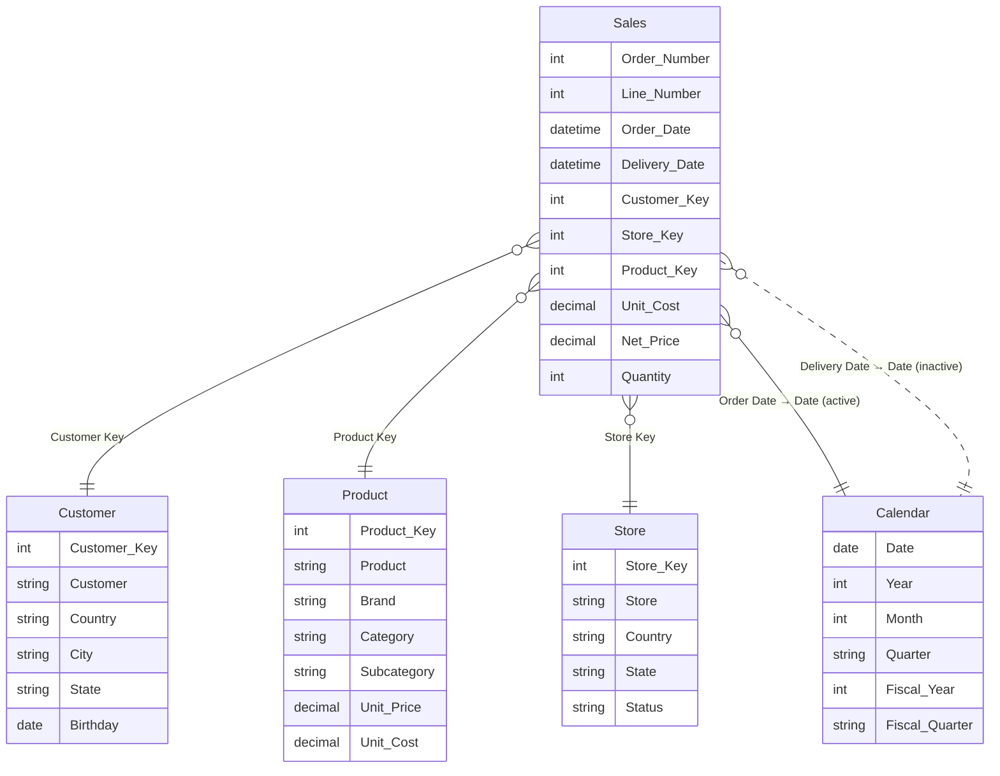

# Sales – Power BI Semantic Model Documentation

> *Auto-generated documentation.*

## Table of Contents
1. [Overview](#overview)
2. [Table Relationships](#table-relationships)
3. [Tables and Columns](#tables-and-columns)
4. [Measures](#measures)
5. [Row-Level Security](#row-level-security)
6. [Data Sources](#data-sources)

---

## Overview

The **Sales** semantic model is a retail sales analytics model that provides a comprehensive view of sales transactions, customers, products, stores, and time. It enables reporting on revenue, costs, margins, and customer behaviour across different geographies and time periods.

| Item | Count |
|------|-------|
| Tables | 6 |
| Relationships | 5 (4 active, 1 inactive) |
| Measures | 13 |
| Security Roles | 2 |
| Storage Mode | Import |

---

## Table Relationships



> **Note:** The relationship between `Sales[Delivery Date]` and `Calendar[Date]` is **inactive** and must be activated explicitly in DAX using `USERELATIONSHIP` when needed.

---

## Tables and Columns

### Calendar
Date dimension table generated dynamically in Power Query. Covers a rolling 4-year window ending on December 31 of the current year.

| Column | Data Type | Description |
|--------|-----------|-------------|
| Date | DateTime | Primary date key |
| Day | Int64 | Day of the month (1–31) |
| Month | Int64 | Month number (1–12) |
| Month Name | String | Abbreviated month name (e.g., Jan) |
| Quarter | String | Calendar quarter (e.g., Q1) |
| Year | Int64 | Calendar year |
| Year Month | DateTime | Year-month date value |
| Week Number | Int64 | ISO week number of the year |
| Day of Week | Int64 | Day of week (1 = Sunday) |
| Day Name | String | Full name of the day |
| Is Weekend | Boolean | True if the date falls on a Saturday or Sunday |
| Fiscal Year | Int64 | Fiscal year (July–June, year-end label) |
| Fiscal Quarter | String | Fiscal quarter (e.g., FQ1) |

### Sales
Fact table containing individual sales transaction lines sourced from a CSV file.

| Column | Data Type | Display Folder | Description |
|--------|-----------|----------------|-------------|
| Order Number | Int64 | Degenerate Dimensions | Unique sales order identifier — a single order can have multiple lines |
| Line Number | Int64 | Degenerate Dimensions | Line number within a sales order |
| Order Date | DateTime | Keys › Dates | Date the order was placed — primary date relationship to Calendar |
| Delivery Date | DateTime | Keys › Dates | Date the order was delivered |
| Customer Key | Int64 | Keys | Foreign key to Customer |
| Store Key | Int64 | Keys | Foreign key to Store |
| Product Key | Int64 | Keys | Foreign key to Product |
| Quantity | Int64 | Facts | Number of units sold |
| Net Price | Decimal | Facts | Net selling price per unit |
| Unit Cost | Decimal | Facts | Unit cost of the product at time of sale |
| Currency Code | String | Facts | ISO currency code (e.g., USD, EUR) |
| Exchange Rate | Decimal | Facts | Exchange rate applied to convert to base currency |
| Time | DateTime | Facts | Randomised transaction time |
| Environment | String | Facts | Deployment environment tag (DEV / QUAL / PRD) |

### Product
Dimension table for products, sourced from a CSV file.

| Column | Data Type | Display Folder | Description |
|--------|-----------|----------------|-------------|
| Product Key | Int64 | Keys | Primary key |
| Product Code | String | Keys | Unique alphanumeric product code |
| Product | String | Product | Full product name |
| Manufacturer | String | Product | Manufacturer company name |
| Brand | String | Product | Brand name |
| Subcategory | String | Product | Product subcategory |
| Category | String | Product | Top-level product category |
| Color | String | Attributes | Product colour |
| Weight Unit Measure | String | Attributes | Unit of measure for weight (e.g., kg, lb) |
| Weight | Decimal | Attributes | Product weight |
| Unit Cost | Decimal | Attributes | Standard cost to produce or purchase |
| Unit Price | Decimal | Attributes | Standard retail price |
| Subcategory Code | String | Keys | Subcategory code |
| Category Code | String | Keys | Category code |

### Customer
Dimension table for customers, sourced from a CSV file.

| Column | Data Type | Display Folder | Description |
|--------|-----------|----------------|-------------|
| Customer Key | Int64 | Keys | Primary key |
| Customer | String | Customer | Full customer name |
| Gender | String | Attributes | Customer's gender |
| Address | String | Attributes | Street address |
| City | String | Attributes | City of residence |
| State Code | String | Attributes | Two-letter state/province abbreviation |
| State | String | Attributes | Full state/province name |
| Zip Code | String | Attributes | Postal/zip code |
| Country Code | String | Attributes | ISO country code |
| Country | String | Attributes | Country of residence |
| Continent | String | Attributes | Continent of residence |
| Birthday | DateTime | Attributes | Date of birth |
| Age | Calculated | Attributes | Current age in years (calculated from Birthday) |

### Store
Dimension table for retail store locations, sourced from a CSV file.

| Column | Data Type | Display Folder | Description |
|--------|-----------|----------------|-------------|
| Store Key | Int64 | Keys | Primary key |
| Store Code | String | Keys | Unique alphanumeric store code |
| Store | String | Store | Store name |
| Country | String | Store | Country where the store is located |
| State | String | Store | State/region of the store |
| Square Meters | Int64 | Attributes | Total floor area in square metres |
| Open Date | DateTime | Attributes | Date the store opened |
| Close Date | DateTime | Attributes | Date the store closed (if applicable) |
| Status | String | Attributes | Operational status (e.g., Open, Closed) |

### About
Metadata table providing model version and authorship information.

| Column | Data Type | Description |
|--------|-----------|-------------|
| Key | String | Metadata field name |
| Value | String | Metadata field value |
| Order | Int64 | Display sort order |

---

## Measures

All measures are organised into the following display folders under **0. Measures**:

| Folder | Measures |
|--------|---------|
| 1. Value | Sales Amount, Sales Amount LY, Sales Amount Daily Average, Sales Amount 12 Month Average, Sales Amount 6 Month Average, Margin, Cost |
| 2. Quantity | Sales Quantity |
| 3. Lines | # Sales, # Customers with Sales |
| (root) | # Products, # Customers, # Stores |

---

### Sales Amount
**Business logic:** Calculates the total revenue for the selected period by summing the product of quantity sold and net price for each transaction line.

```dax
Sales Amount = SUMX('Sales', 'Sales'[Quantity] * 'Sales'[Net Price])
```

---

### Sales Amount LY
**Business logic:** Returns the Sales Amount for the same period in the prior year. Returns blank when there is no current-year sales, preventing misleading prior-year comparisons when no selection exists.

```dax
Sales Amount LY =
IF ([Sales Amount] > 0, CALCULATE([Sales Amount], SAMEPERIODLASTYEAR('Calendar'[Date])))
```

---

### Sales Amount Daily Average
**Business logic:** Calculates the average daily sales amount across all dates in the selected period. Useful for normalising revenue across periods of different lengths.

```dax
Sales Amount Daily Average = AVERAGEX(VALUES('Calendar'[Date]), [Sales Amount])
```

---

### Sales Amount 12 Month Average
**Business logic:** Rolling 12-month average of daily sales, anchored to the last date with actual sales. Returns blank for periods that fall entirely before the first date of sales data, preventing chart artefacts.

```dax
Sales Amount 12 Month Average =
VAR v_selDate =
    MAX ( 'Calendar'[Date] )
VAR v_period =
    DATESINPERIOD ( 'Calendar'[Date], v_selDate, -12, MONTH )
VAR v_result =
    CALCULATE ( AVERAGEX ( VALUES ( 'Calendar'[Date] ), [Sales Amount] ), v_period )
VAR v_firstDate =
    MINX ( v_period, 'Calendar'[Date] )
VAR v_lastDateSales =
    MAX ( Sales[Order Date] )
RETURN
    IF ( v_firstDate <= v_lastDateSales, v_result )
```

---

### Sales Amount 6 Month Average
**Business logic:** Rolling 6-month average of daily sales, anchored to the last date with actual sales. Shorter window than the 12-month average for detecting more recent trends.

```dax
Sales Amount 6 Month Average =
VAR v_selDate =
    MAX ( 'Calendar'[Date] )
VAR v_period =
    DATESINPERIOD ( 'Calendar'[Date], v_selDate, -6, MONTH )
VAR v_result =
    CALCULATE ( AVERAGEX ( VALUES ( 'Calendar'[Date] ), [Sales Amount] ), v_period )
VAR v_firstDate =
    MINX ( v_period, 'Calendar'[Date] )
VAR v_lastDateSales =
    MAX ( Sales[Order Date] )
RETURN
    IF ( v_firstDate <= v_lastDateSales, v_result )
```

---

### Margin
**Business logic:** Gross margin in currency terms — the total profit before overhead, calculated as net price minus unit cost multiplied by quantity for each transaction line.

```dax
Margin =
SUMX (
    Sales,
    Sales[Quantity]
        * ( Sales[Net Price] - Sales[Unit Cost] )
)
```

---

### Cost
**Business logic:** Total cost of goods sold — the sum of quantity multiplied by unit cost across all transaction lines.

```dax
Cost = SUMX ( Sales, Sales[Quantity] * Sales[Unit Cost] )
```

---

### Sales Quantity
**Business logic:** Total number of units sold across all transaction lines in the selected context.

```dax
Sales Quantity = SUM('Sales'[Quantity])
```

---

### # Sales
**Business logic:** Count of individual sales transaction lines (rows) in the Sales table for the selected context.

```dax
# Sales = COUNTROWS('Sales')
```

---

### # Customers with Sales
**Business logic:** Count of distinct customers who have at least one sales transaction in the selected period. Useful for active-customer metrics.

```dax
# Customers with Sales = DISTINCTCOUNT('Sales'[Customer Key])
```

---

### # Products
**Business logic:** Total number of products in the Product dimension table, regardless of sales. Typically used as a scalar reference value on overview pages.

```dax
# Products = COUNTROWS('Product')
```

---

### # Customers
**Business logic:** Total number of customers in the Customer dimension table. Provides the full customer universe as opposed to only customers with sales.

```dax
# Customers = COUNTROWS('Customer')
```

---

### # Stores
**Business logic:** Total number of stores in the Store dimension table. Provides the full store universe.

```dax
# Stores = COUNTROWS('Store')
```

---

## Row-Level Security

Two RLS roles are defined, both restricting access to the **Store** table by country. Users assigned to a role will only see sales data associated with stores in the permitted country.

| Role | Table | Filter Expression | Description |
|------|-------|-------------------|-------------|
| Store - Canada | Store | `[Country] == "Canada"` | Limits visibility to Canadian stores only |
| Store - United States | Store | `[Country] == "United States"` | Limits visibility to US stores only |

> **Note:** Because the Store table filters propagate through the active relationships, assigning a user to one of these roles will also restrict all Sales, Product, and Customer data to records associated with the permitted stores.

---

## Data Sources

All tables (except **Calendar** and **About**) are loaded from CSV files hosted on GitHub via HTTP. The base URL is controlled by the `HttpSource` Power Query parameter.

### Parameters

| Parameter | Default Value | Description |
|-----------|--------------|-------------|
| `HttpSource` | `https://raw.githubusercontent.com/pbi-tools/sales-sample/data/` | Base URL for all CSV file downloads |
| `Environment` | `DEV` | Deployment environment tag stamped onto each Sales row. Allowed values: DEV, QUAL, PRD |
| `RangeStart` | `2020-01-01 00:00:00` | Inclusive start date for Sales data filtering |
| `RangeEnd` | `2024-12-31 00:00:00` | Inclusive end date for Sales data filtering |

### Sales
- **Source:** `{HttpSource}/RAW-Sales.csv` (CSV, UTF-8)
- **Key steps:** Loads 13 columns; adjusts order/delivery dates to keep data within a rolling 3-year window relative to today; randomises quantity and net price by a configurable `Randomizer` factor; filters rows to the `[RangeStart, RangeEnd]` window; appends the `Environment` tag.

### Product
- **Source:** `{HttpSource}/RAW-Product.csv` (CSV, UTF-8, 14 columns)
- **Key steps:** Renames `Product Name` → `Product`.

### Customer
- **Source:** `{HttpSource}/RAW-Customer.csv` (CSV, UTF-8, 13 columns)
- **Key steps:** Renames `Name` → `Customer`; removes the source `Age` column (age is instead provided as a calculated column in the model).

### Store
- **Source:** `{HttpSource}/RAW-Store.csv` (CSV, UTF-8, 9 columns)
- **Key steps:** Renames `Name` → `Store`.

### Calendar
- **Source:** Computed entirely in Power Query — no external file.
- **Key steps:** Generates a contiguous date list from January 1 of `(currentYear − 3)` to December 31 of `currentYear`; adds calendar and fiscal year/quarter attributes inline.

### About
- **Source:** Hard-coded in-memory table with model metadata (developer, version, description, last refresh timestamp).
